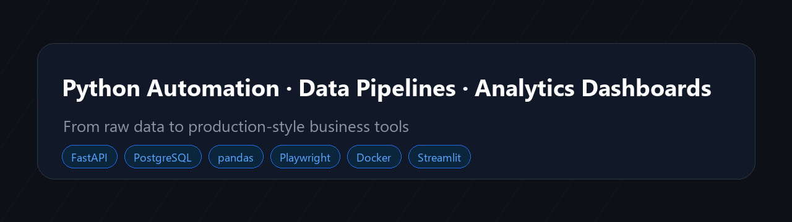

# Python Automation & Data Analytics Engineer

I build production-style Python systems for data collection, automation, analytics, and business reporting.

My main focus is turning raw, messy data into reliable tools: web scraping pipelines, browser automation, PostgreSQL databases, FastAPI services, data quality checks, dashboards, Telegram alerts, and analytical reports.

Portfolio: [ushutka.github.io/portfolio](https://ushutka.github.io/portfolio/)

## Core Skills

**Backend & Automation:** Python, FastAPI, Selenium, Playwright, REST APIs, Telegram Bot API

**Data & Analytics:** SQL, PostgreSQL, pandas, data cleaning, KPI analysis, cohort analysis, RFM, dashboards

**Engineering:** Docker, Docker Compose, pytest, GitHub Actions, logging, error handling, environment-based configuration

**Data Pipelines:** ETL/ELT, scheduled jobs, validation, incremental loading, deduplication, monitoring

## Featured Production-Style Projects

### [Market Intelligence & Competitor Analytics Platform](https://github.com/uShutka/market-intelligence-platform)

Production-style platform for collecting product prices from multiple sources, storing historical changes in PostgreSQL, detecting anomalies, exposing analytics through FastAPI, and sending Telegram alerts.

**Stack:** Python, Playwright, FastAPI, PostgreSQL, SQLAlchemy, pandas, Docker, pytest, Streamlit

### [Sales & Retention Analytics Warehouse](https://github.com/uShutka/sales-retention-analytics-warehouse)

End-to-end analytics project with cleaned transactional data, SQL data marts, retention analysis, cohort reports, LTV, RFM segmentation, and business recommendations.

**Stack:** Python, SQL, PostgreSQL, pandas, dbt-style modeling, Streamlit

### [Data Quality Monitoring Platform](https://github.com/uShutka/data-quality-monitoring-platform)

Data quality platform for validating datasets, detecting duplicates, nulls, invalid formats, outliers, schema issues, and generating structured reports.

**Stack:** Python, pandas, FastAPI, PostgreSQL, Jinja2, Docker, pytest

### [Freelance Job Market Intelligence System](https://github.com/uShutka/freelance-job-intelligence-system)

System that collects freelance and remote job posts, extracts skills and rates, scores relevance, stores results, visualizes market trends, and sends Telegram notifications.

**Stack:** Python, PostgreSQL, pandas, FastAPI, Streamlit, Telegram Bot API

### [Selenium Workflow Automation Kit](https://github.com/uShutka/selenium-workflow-automation-kit)

Production-style Selenium automation template with explicit waits, retries, logging, screenshots on failure, and Docker setup.

**Stack:** Python, Selenium, Docker, pytest, logging

### [API To Excel Reporting Tool](https://github.com/uShutka/api-to-excel-reporting-tool)

Tool for collecting API data, transforming it with pandas, and generating clean Excel reports for business users.

**Stack:** Python, REST APIs, pandas, openpyxl, reporting automation

## What I Usually Build

- Data collection and scraping systems
- Browser automation workflows
- SQL-based analytical reports
- Business dashboards
- Telegram bots and alerting systems
- CSV/Excel automation
- Data quality and validation tools
- API services for internal tools

## Data Analytics Skills

- Exploratory data analysis
- KPI design and reporting
- Cohort and retention analysis
- RFM segmentation
- Price and competitor analytics
- Data quality checks
- Dashboard design
- Business recommendations from raw data

## Engineering Approach

I focus on building maintainable systems, not one-file scripts.

My projects usually include:

- Clean project structure
- Database schema design
- Dockerized local setup
- Automated tests
- Logging and error handling
- Environment-based configuration
- API documentation
- Analytical conclusions
- Clear README and architecture description

## Contact

Open to freelance and remote work related to Python automation, data pipelines, scraping, analytics dashboards, and internal business tools.

Portfolio: [https://ushutka.github.io/portfolio/](https://ushutka.github.io/portfolio/)
